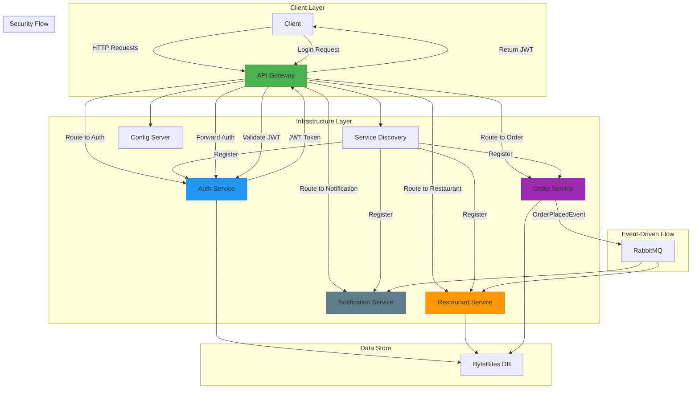
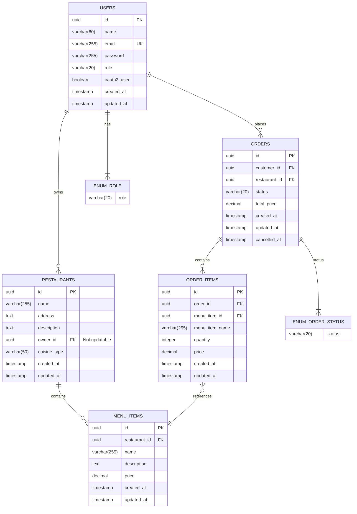
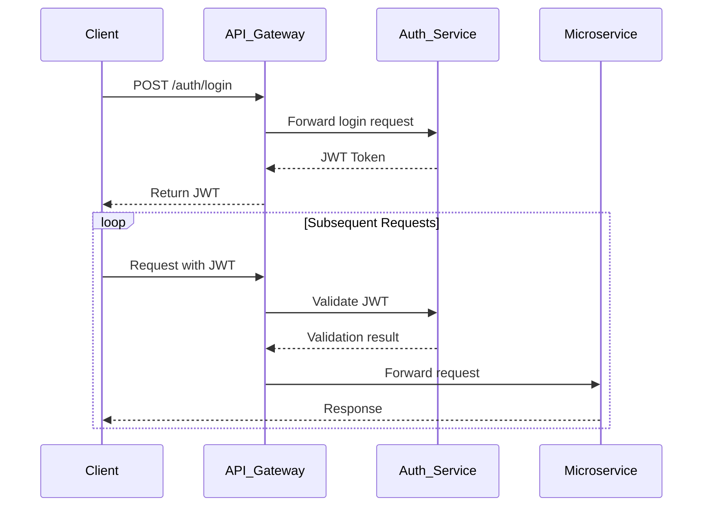
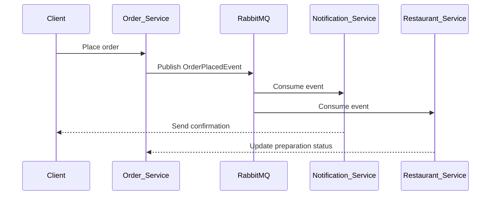

# ByteBites Food Delivery Platform - Microservices Architecture

## Overview

ByteBites is a cloud-native food delivery platform built with Spring Boot microservices. This architecture provides a scalable, secure, and resilient system for connecting customers with local restaurants.

## Architecture Diagram



#### Database Schema for Services


## Key Components

### Core Infrastructure Services
- **Discovery Server**: Eureka service registry
- **Config Server**: Centralized configuration management
- **API Gateway**: Routes requests and handles security

### Business Services
- **Auth Service**: Handles authentication and JWT issuance
- **Restaurant Service**: Manages restaurant data and menus
- **Order Service**: Processes food orders
- **Notification Service**: Handles customer notifications

## Security Implementation

- JWT-based authentication
- Role-Based Access Control (RBAC)
- OAuth2 integration for social login
- Resource ownership validation
- Secure inter-service communication

#### Sequence Diagram: Login & JWT Flow


## Getting Started

### Prerequisites
- Java 17+
- Docker (for PostgreSQL, MongoDB, RabbitMQ and Redis)
- Git

### Service Startup Order
1. Discovery Server
2. Config Server
3. API Gateway
4. Auth Service
5. Restaurant Service
6. Order Service
7. Notification Service

### Installation
1. Clone the repository:
```bash
  git clone https://github.com/thenoblet/bytebites.git
```

2. Start infrastructure services:
```bash
  docker-compose up -d postgres mongodb rabbitmq redis
```

3. Run services in this order:
```
#1. Infrastructure
discovery-server/
config-server/

# 2. Core Services
api-gateway/
auth-service/

# 3. Business Services
restaurant-service/
order-service/
notification-service/
```

## Testing the System

### Authentication Flow
1. Register a user: `POST /auth/register`
2. Login to get JWT: `POST /auth/login`
3. Use JWT for subsequent requests


| Endpoint | Method | Role Required |
|----------|--------|---------------|
| /auth/register | POST | Public |
| /api/v1/restaurants | GET | Authenticated |
| /api/v1/orders | POST | ROLE_CUSTOMER |
| /admin/users | GET | ROLE_ADMIN |

## Event-Driven Communication

The system uses RabbitMQ for:
- Order placement notifications
- Restaurant order processing updates
- Customer notifications

### Event Flow with RabbitMQ


## Monitoring

Each service includes Spring Boot Actuator endpoints and Prometheus/Grafana for health checks and metrics.


## License

This project is licensed under the MIT License.
